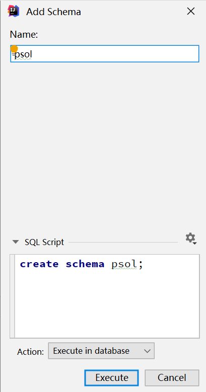
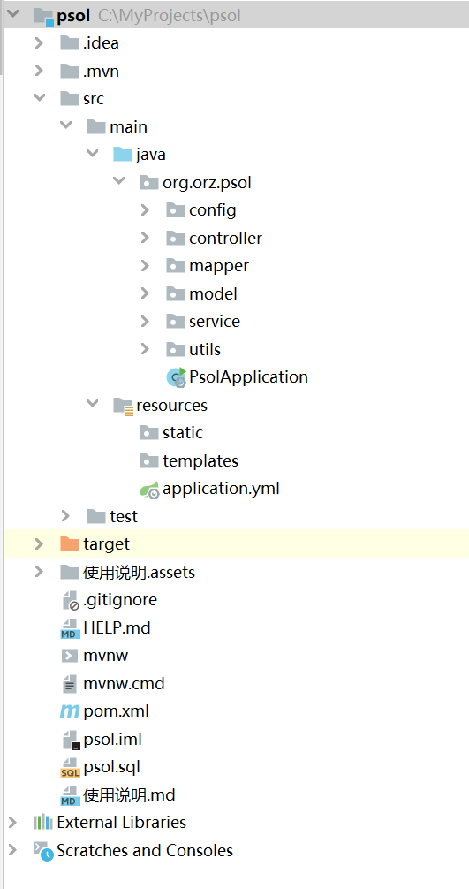
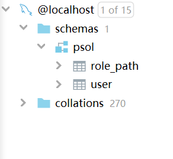
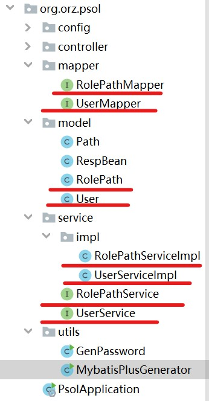
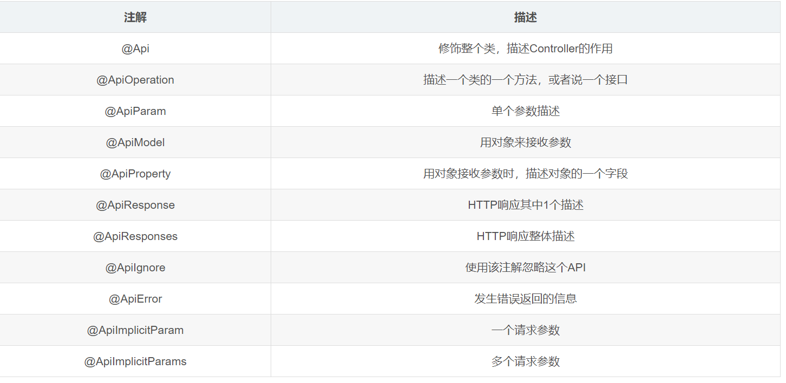
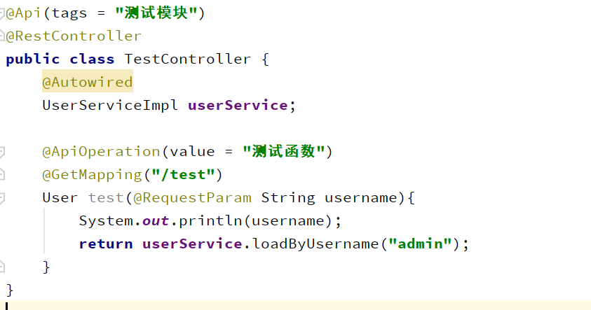
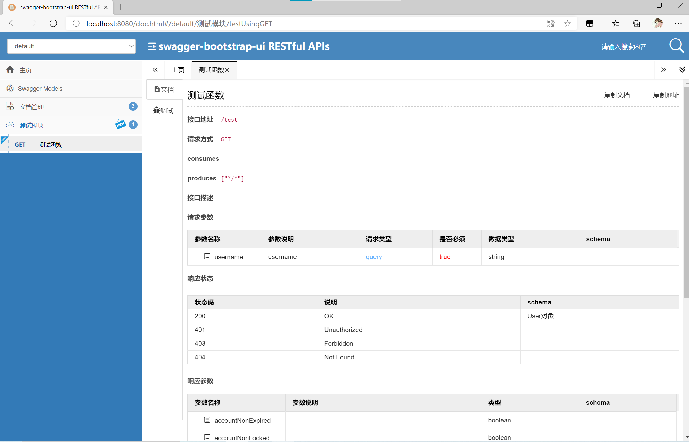
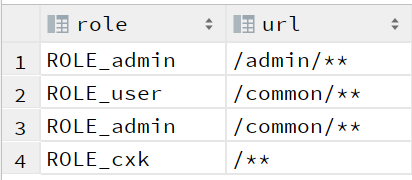
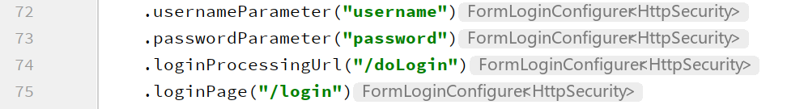

[TOC]

**建议用typora阅读**

# 准备工作

## 1.执行sql脚本生成数据库

- **创建一个数据库**



- **执行sql脚本**


## 2.配置数据库连接

- resources目录下，application.yml文件中配置用户名、密码、url，顺便配置服务器启动端口


## 3.下载依赖

- 打开pom.xml，点击Import Changes


# 项目目录结构



- Java类目录如上图所示，PsolApplication为启动类

- resources目录为静态资源目录，下属static目录放置静态资源文件，templates目录放置模板文件，application.yml为项目配置文件

- pom.xml为依赖管理文件，如以下方式添加依赖

  ```xml
  <dependency>
      <groupId>mysql</groupId>
      <artifactId>mysql-connector-java</artifactId>
      <scope>runtime</scope>
      <version>8.0.11</version>
  </dependency>
  ```

# 使用说明

## 1.MyBatisPlus从数据表自动生成代码

1）数据库中建立实体类数据表



2）MybatisPlusGenerator类中对代码的生成进行配置，在utils包下

```java
public class MybatisPlusGenerator {
    public static void main(String[] args) {
        AutoGenerator mpg = new AutoGenerator();

        GlobalConfig gc = new GlobalConfig();
        String projectPath = System.getProperty("user.dir");
        gc.setOutputDir(projectPath+"/src/main/java");
        gc.setOpen(false);
        gc.setFileOverride(true);//再次生成文件是否覆盖之前文件
        gc.setServiceName("%sService");//Service类命名方式，Service为接口类
        gc.setMapperName("%sMapper");//Mapper类命名方式
        gc.setXmlName("%sMapper");//Mapper对应xml文件命名方式
        gc.setServiceImplName("%sServiceImpl");//Service实现类命名方式
        gc.setControllerName("%sController");//实体类的Controller生成方式，一般不需要，后文配置不生成Controller类
        gc.setDateType(DateType.ONLY_DATE);
        gc.setSwagger2(true);//支持swagger2
        mpg.setGlobalConfig(gc);


        DataSourceConfig dsc = new DataSourceConfig();
        // 数据库配置,修改成自己的url，用户名密码
        dsc.setUrl("jdbc:mysql://localhost:3306/psol?useSSL=false&useUnicode=true&characterEncoding=utf-8&serverTimezone=UTC");
        dsc.setDriverName("com.mysql.cj.jdbc.Driver");
        dsc.setUsername("root");
        dsc.setPassword("123456");
        dsc.setDbType(DbType.MYSQL);
        mpg.setDataSource(dsc);

        PackageConfig pc = new PackageConfig();
        pc.setModuleName("psol");
        pc.setParent("org.orz");
        pc.setEntity("model");//配置实体类包名
        pc.setMapper("mapper");//配置Mapper类包名
        pc.setService("service");//配置Service类包名
        pc.setController("controller");//配置Controller类包名
        mpg.setPackageInfo(pc);

        StrategyConfig strategy = new StrategyConfig();
        /*
            配置需要生成代码的表名，多个表用逗号隔开
            strategy.setInclude("table1","table2");
        */
        strategy.setInclude("user","role_path");
        strategy.setNaming(NamingStrategy.underline_to_camel);
        strategy.setColumnNaming(NamingStrategy.underline_to_camel);
        strategy.setEntityLombokModel(true);//实体类应用lombok模式
        strategy.setRestControllerStyle(true);
        mpg.setStrategy(strategy);

        TemplateConfig tmp = new TemplateConfig();
        // 不生成Controller和xml文件
        tmp.setController("");
        tmp.setXml(null);

        mpg.setTemplate(tmp);
        mpg.execute();
    }
}
```

​	如果要生成xml文件，注释掉该行

```java
tmp.setXml(null);
```

3) 运行MyBatisPlusGenerator生成代码

​										

## 2.实体类使用Lombok注释减少代码

更详细用法请看[Lombok指南](https://mp.weixin.qq.com/s/DZn4I0H_kKNzweK_pUlDIA)

1）**@Getter 和 @Setter**

​		注释在类上，会为类中所有字段生成Getter和Setter方法

```java
@Getter
@Setter
public class Path {
    String url;
    List<String> roles;
}
```

​		注释在字段上会为该字段生成Getter和Setter方法

```java
public class Path {
    String url;
    @Getter
    @Setter
    List<String> roles;
}
```

2） **@NoArgsConstructor 和 @AllArgsConstructor**

​		注释在类上，为类生成无参构造和需要全部参数的构造函数

3） **@ToString**

​		注释在类上，为类生成toString()方法

4）@**Data** (**强烈推荐使用噢！！！**)

​		等价与同时使用**@ToString **、**@Getter 和 @Setter**、 **@NoArgsConstructor 和 @AllArgsConstructor**

​		类加上一个@Data，直接服务到家（泪目😭）

```java
@Data
public class Path {
    String url;
    List<String> roles;

    public void addRole(String role) {
        this.roles.add(role);
    }
}
```

## 3.MybatisPlus的CRUD操作

### 1) 定义和使用步骤

以User实体类为例

**step1：**在UserServiceImpl类中注入UserMapper

```java
@Service
public class UserServiceImpl extends ServiceImpl<UserMapper, User> implements UserService {
    @Autowired
    UserMapper userMapper;
}
```

**step2:**  在UserServiceImpl类中定义CRUD方法

```java
@Service
public class UserServiceImpl extends ServiceImpl<UserMapper, User> implements UserService {
    @Autowired
    UserMapper userMapper;

    public User loadByUsername(String username) {
        QueryWrapper<User> wrapper = new QueryWrapper<>();
        wrapper.eq("username", username);
        return userMapper.selectOne(wrapper);
    }
}
```

**step3：** 在controller中注入UserServiceImpl，调用方法

```java
@RestController
public class TestController {
    @Autowired
    UserServiceImpl userService;

    @GetMapping("/user")
    User test(){
        User user = userService.loadByUsername("admin");
        return user;
    }
}
```

### 2) 使用Mapper进行CRUD操作

使用前先在当前文件下注入对应mapper（以UserMapper为例）

```java
@Autowired
UserMapper userMapper;
```

#### 增加（Create）

```java
@SpringBootTest
class PsolApplicationTests {
    @Autowired
    UserMapper userMapper;
    /**
     * 使用insert方法， 接收一个对象作为参数
     */
    @Test
    void test() {
        User user = new User();
        user.setUsername("user1");
        user.setRole("ROLE_user");
        userMapper.insert(user);
    }
}
```

#### 查询（Retrieve）

```java
/**
 * selectByMap方法，传入一个ColumnMap，返回值为list数组
 */
@Test
void test1() {
    Map<String, Object> map = new HashMap<>();
    map.put("username","admin");
    List<User> users;
    users = userMapper.selectByMap(map);
    System.out.println(users);
}
```

```java
/**
 * selectById和selectByIds，通过Id查询，返回单个和多个对象
 */
@Test
void test2() {
    User user = userMapper.selectById(1);
    System.out.println(user);
    List<Integer> ids = new ArrayList<>();
    ids.add(2);
    ids.add(3);
    List<User> users = userMapper.selectBatchIds(ids);
    System.out.println(users);
}
```

```java
/**
 *  selectList 和 selectOne，返回多条和单条，通过QueryWrapper查询
 */
@Test
void test3() {
    QueryWrapper<User> wrapper = new QueryWrapper<>();
    /*
     * eq 等于 =
     * ne 不等于 <>
     * gt 大于 >
     * like like("name", "王")--->name like '%王%'
     * isNull isNull("name")
     * 更多见 https://mybatis.plus/guide/wrapper.html#abstractwrapper
     */
    wrapper.eq("username", "admin");
    List<User> users = userMapper.selectList(wrapper);
    System.out.println(users);
    User user = userMapper.selectOne(wrapper);
    System.out.println(user);
}
```

```java
/**
 * selectCount方法，用QueryWrapper查询，返回符合条件的记录条数
 */
@Test
void test4() {
    QueryWrapper<User> wrapper = new QueryWrapper<>();
    wrapper.eq("username", "admin");
    Integer n = userMapper.selectCount(wrapper);
    System.out.println(n);
}
```

#### 修改（Update）

```java
/**
 * update方法批量更新
 * wrapper中存储需要更改的记录的筛选条件
 * 新建一个对象，对象中设置需要更改的字段的值
 */
@Test
void test5() {
    QueryWrapper<User> wrapper = new QueryWrapper<>();
    wrapper.eq("activate", false);
    User user = new User();
    user.setActivate(true);
    userMapper.update(user,wrapper);
}
```

```java
/**
 * update 方法更新单条记录
 */
@Test
void test6() {
    QueryWrapper<User> wrapper = new QueryWrapper<>();
    wrapper.eq("username", "user1");
    User user = userMapper.selectOne(wrapper);
    userMapper.updateById(user);
}
```

#### 删除（Delete）

```java
/**
 * easy huh
 */
@Test
void test7() {
    QueryWrapper<User> wrapper = new QueryWrapper<>();
    wrapper.eq("username", "user1");
    userMapper.delete(wrapper);
    Map<String, Object> map = new HashMap<>();
    map.put("username","admin");
    userMapper.deleteByMap(map);
    userMapper.deleteById(1);
}
```

### 3) ServiceImpl服务实现类自带的CRUD函数

```java
@Autowired
UserServiceImpl userService;
```

```java
@Test
void test8() {
    QueryWrapper<User> wrapper = new QueryWrapper<>();
    wrapper.eq("activate", false);

    // 查询单条
    User user = userService.getOne(wrapper);
    User user1 = userService.getById(1);
    //查询多条
    List<Map<String, Object>> list = userService.listMaps();
    List<Map<String, Object>> list1 = userService.listMaps(wrapper);
    List<User> users = userService.list();
    List<User> users1 = userService.list(wrapper);
    // 更新单条
    userService.update(user, wrapper);
    // save单条
    userService.save(user);
    // save多条
    userService.saveBatch(users);
    // 保存或更新
    userService.saveOrUpdate(user, wrapper);
    // 满足条件删除
    userService.remove(wrapper);
    userService.removeById(1);
}
```

## 4.Swagger2注释用于生成接口文档

访问 **/doc.html**调试和查看接口！！！！







# 配置信息

## 1.权限配置

- user表中role字段配置用户的权限，role字段要以   **ROLE_**    开头


- role_path表中配置相应权限可以访问的路径



## 2.登陆接口



- 用户未登录应该被重定向路径   **/login** ，处理   **/login**  的controller应该返回一个登陆页面或者提示登录的信息，controller还未实现。
- 用户登录则往  **/doLogin** 接口发送post请求，需要 **username**和 **password**两个请求参数。该接口已经由SpringSecutity实现。
- 登出接口为  **/logout** ，登出后自动清除用户信息。该接口已经由SpringSecutity实现。

- **SecurityConfig**为SpringSecurity的配置类，里面可以修改配置信息。